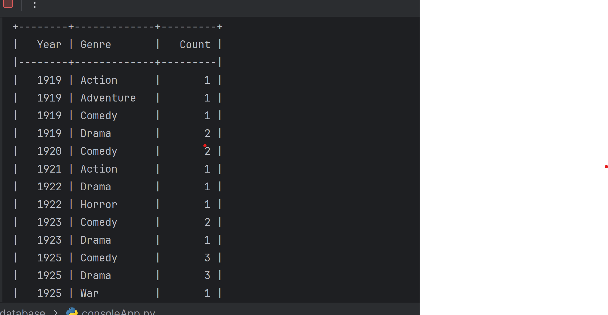
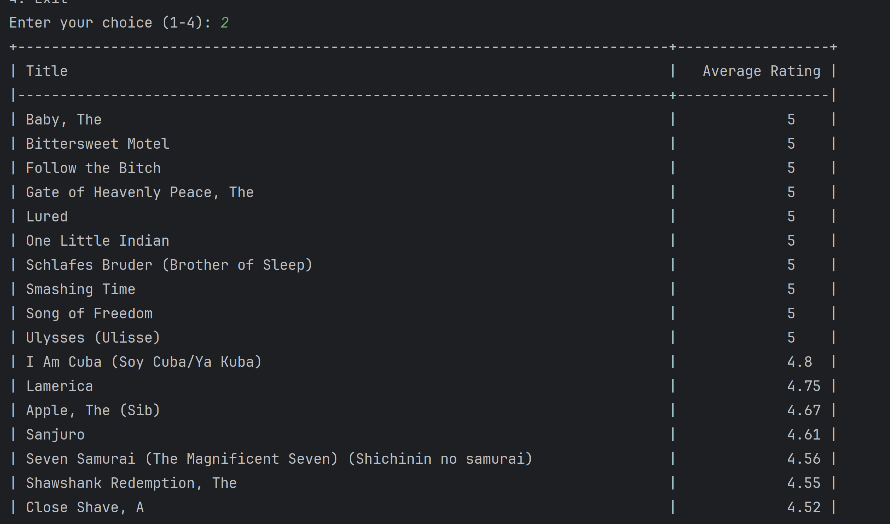
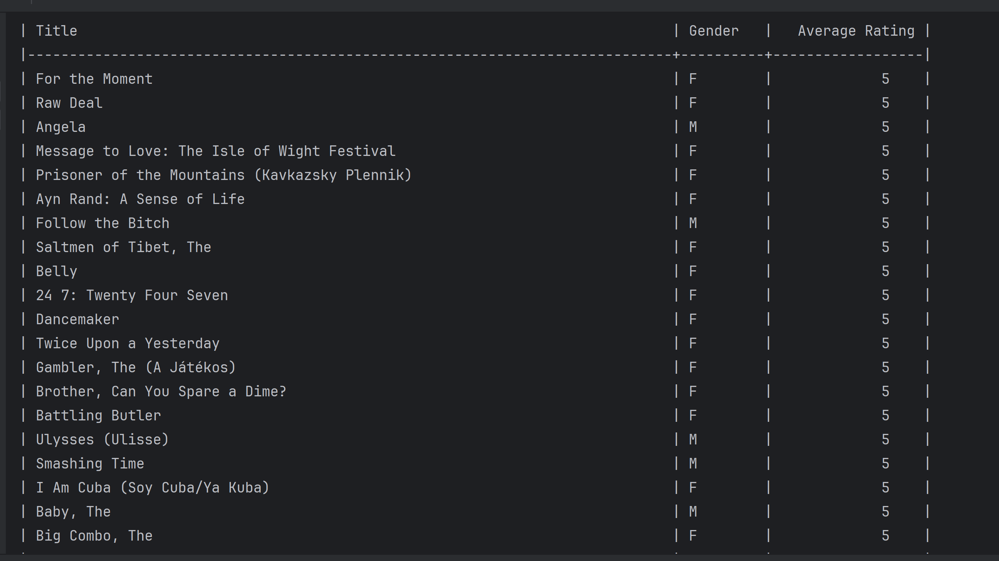

# Movie_database

## Description 
This is a movie database that allows users to generate either of these tables: 
1. Genre Distribution Analysis by Year

2. Sort Movies by Average Rating

3. Average Rating by Gender


## Installation
you need to install the following packages:
* sqlite3
* read_csv
* tabulate

## Usage
To run the program, you need to run the following command in the terminal:
    ```python3 main.py```
This should output a menu
Note: 
When you run ```python3 main.py``` by default the database needs to be built which takes some time, it can take up to an hour. 
After building the database the first time you can set the variable ```rebuild=False``` in the db.py file to speed up the process.


